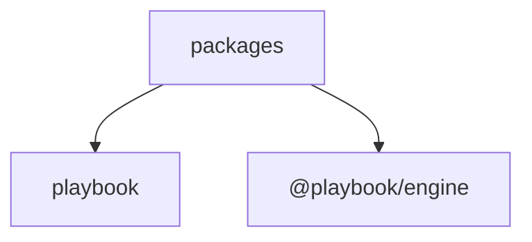
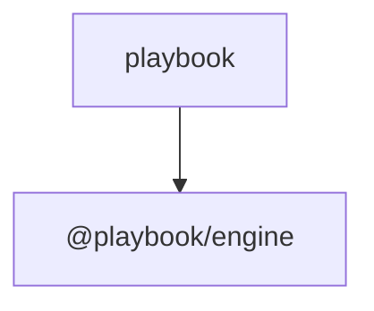

# Architecture Diagrams

## Structure

## Dependencies

## Legend
- Structure edges (`A --> B`) represent containment from top-level directory to package/workspace.
- Dependency edges (`A --> B`) represent internal package dependency direction (A depends on B).

## Generation
- Command: `playbook diagram --repo . --out docs/ARCHITECTURE_DIAGRAMS.md`
- Limits: maxNodes=60, maxEdges=120
- Exclusions: **/node_modules/**, **/dist/**, **/build/**, **/.next/**, **/.git/**
- Dependency source: workspace-manifests
