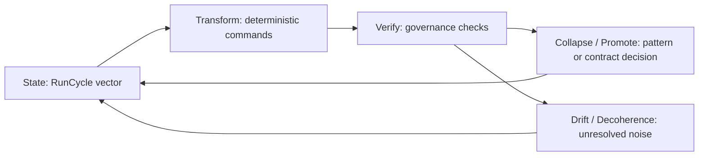

# Bloch-Sphere State-Space Analogy for Playbook

## Purpose

This note captures a strict state-space analogy that helps reason about Playbook cycle behavior.

The Bloch sphere is used as geometry for deterministic systems thinking, not as a claim that Playbook performs quantum computation.

## Warning: use as state-space metaphor, not literal physics import

Use this model only when it clarifies deterministic engineering behavior:

- state representation
- transformation sequencing
- verification/measurement decisions
- drift/noise and stabilization pressure

Do not import quantum-physics claims into Playbook design discussions.

## Why geometry helps deterministic engineering systems

Geometry provides an implementation-oriented way to reason about system trajectories:

- A bounded space makes "where the system is" explicit.
- Transformations become directional changes, not just raw event lists.
- Measurements become deterministic readouts that can gate promotion decisions.
- Drift and stabilization can be compared cycle-to-cycle using distance and direction.

Raw logs remain critical evidence, but geometry is often a better control-plane abstraction for convergence, compaction, and promotion behavior.

## Compact analogy table

| Model element | Classical bit | Qubit (Bloch representation) | Playbook state-space analogy |
| --- | --- | --- | --- |
| State form | `0` or `1` | Unit-vector direction with amplitude-derived measurement probabilities | Bounded state vector derived from RunCycle metrics and evidence quality |
| Transition | Logical operation | Gate rotation | Deterministic command sequence (`verify -> plan -> apply -> compact -> promote`) |
| Measurement | Read bit value | Basis-dependent probabilistic measurement | Deterministic governance readouts (`verify`, promotion gates, contract checks) |
| Noise | Bit flips/transmission errors | Decoherence / mixedness increase | Entropy, context drift, stale artifacts, contradictory notes, low-signal zettels |

## Core mapping

- **Qubit state** -> Playbook state vector / repo-cycle state.
- **Bloch sphere** -> bounded state-space visualization for cycle diagnostics.
- **Gate rotations** -> deterministic transformations from commands and lifecycle stages.
- **Measurement** -> `verify`, promotion, and contract decisions that determine whether evidence is stabilized.
- **Pure state** -> coherent, low-conflict context where evidence and contracts align.
- **Mixed state** -> noisy, partial, or conflicting context where confidence is reduced.
- **Decoherence** -> entropy growth, context drift, stale artifacts, and conflicting notes.

## Deterministic cycle diagram

## Attractors and compaction alignment

This model aligns with existing Playbook memory architecture:

- Pattern cards act as **soft attractors** that pull noisy evidence toward reusable guidance.
- Contracts act as **hard attractors** that enforce stable invariants.
- Compaction functions as a projection pressure toward lower-entropy, stable representations that preserve required distinctions.

The useful interpretation is not "quantum behavior"; it is "bounded state evolution under deterministic transforms plus governance gates."

## Where the analogy breaks

To avoid pseudo-physics drift, boundaries are explicit:

1. Playbook is **not quantum computation**.
2. Playbook measurement is **not physical wavefunction collapse**.
3. Multi-qubit scaling behavior does **not** directly map to multi-repo scaling behavior.

The analogy is structural and geometric only.

## RunCycle + Zettelkasten + attractor integration

Use this note alongside:

- `docs/contracts/RUN_CYCLE.md` for artifact envelope and cycle metrics.
- `docs/contracts/ZETTELKASTEN.md` for evidence lifecycle semantics.
- `docs/architecture/ZETTELKASTEN_ATTRACTOR_COMPRESSION.md` for soft/hard attractor behavior.
- `docs/contracts/STATE_SPACE.md` for projection schema and event-level state-space contracts.

## Rule / Pattern / Failure Mode

Rule:
Use quantum/state-space language only when it clarifies deterministic system behavior.

Pattern:
State can often be modeled more clearly as geometry than as raw event logs.

Failure Mode:
Overextending the Bloch-sphere analogy turns a useful state-space model into pseudo-physics.
