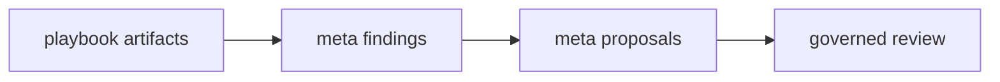

# Meta-Playbook

## Purpose

Meta-Playbook is Playbook's deterministic self-observation layer.

It analyzes existing Playbook artifacts and emits findings, telemetry, and proposals for governed review.

Meta-Playbook is proposal-driven and explicitly **not self-editing**.

## Flow

## Artifact outputs

Each run emits timestamped immutable artifacts:

- `.playbook/meta/findings/<timestamp>@<shortsha>.json`
- `.playbook/meta/telemetry/<timestamp>@<shortsha>.json`
- `.playbook/meta/proposals/<timestamp>@<shortsha>.json`

## Meta objects

- `MetaFinding`: deterministic analytical signal from existing artifacts.
- `MetaTelemetry`: rollup metrics and rates for longitudinal health tracking.
- `MetaProposal`: draft recommendation linked to one or more findings.

## Required detections

Meta analysis detects at least:

- promotion latency
- duplicate pattern pressure
- unresolved draft age
- supersede rate
- entropy trend
- contract mutation frequency

## Safety boundary

The meta layer may only emit findings, telemetry, and proposals.

It may not mutate contracts, pattern cards, thresholds, or schemas automatically.

## Doctrine

Rule:
Meta-Playbook may observe and propose improvements but cannot mutate doctrine automatically.

Pattern:
Proposal-driven self-observation improves process quality without violating governance replayability.

Failure Mode:
If meta-analysis directly edits doctrine, governance becomes non-deterministic and trust collapses.
