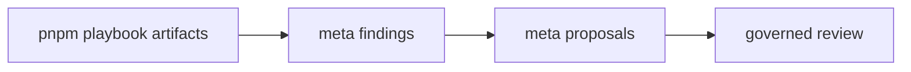

# Meta-Playbook

## Purpose

Meta-Playbook is a deterministic proposal engine that analyzes Playbook artifacts and emits process-improvement recommendations.

Meta-Playbook is proposal-driven, not self-editing.

## Allowed outputs

Meta-Playbook may emit only:

- findings
- telemetry
- proposals

It must not auto-mutate contracts, pattern cards, thresholds, or schemas.

## Governance route

Any self-improvement must flow through normal governance and versioning workflows.
Meta artifacts are input to review, not direct doctrine mutation.

## External pilot guardrails

For bounded external pilots, Meta-Playbook outputs remain advisory and are written to the target repository `.playbook/` directory only.

Disabled for pilot mode:

- automatic contract mutation
- automatic code edits
- cross-repo propagation
- broad functor transforms

## Homeostasis budgets

Meta telemetry tracks policy budgets for governed review:

- canonical core size
- max unresolved draft age
- max contract mutations per cycle
- duplication threshold
- entropy budget trend

## Rule / Pattern / Failure Mode

Rule:
Meta-Playbook may observe and propose improvements but cannot mutate doctrine automatically; initial external pilots must use the current Playbook runtime against a target repository path.

Pattern:
A bounded external pilot validates the reasoning engine without forcing repository-level Playbook synchronization first.

Failure Mode:
Running meta-analysis on an outdated embedded Playbook copy yields false negatives and invalid architecture conclusions.
