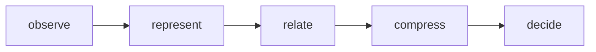

# Playbook Minimum Cognitive Core

## Purpose

This document defines the frozen reasoning kernel boundary for Playbook.

The kernel is domain-agnostic and must stay stable across adapters.

## Core API (domain-agnostic)

The minimum cognitive core exposes exactly five operations:

- `observe`: ingest external signals as raw evidence without interpretation coupling.
- `represent`: normalize evidence into portable knowledge atoms.
- `relate`: create typed links between atoms.
- `compress`: reduce redundant structures into compact reusable patterns.
- `decide`: emit explicit decisions with supporting evidence and confidence.

## Core objects (domain-agnostic)

- `Evidence`: immutable observation with provenance, timestamp, and source metadata.
- `Zettel`: compact representation unit created from one or more evidence items.
- `Edge`: typed relation between represented units.
- `Pattern`: compressed reusable structure inferred from linked units.
- `Decision`: explicit output backed by evidence and pattern context.

The core object model must not encode repository-, CI-, or contract-specific assumptions.

## Kernel boundary

The kernel only defines **how reasoning works**. It does not define **which artifacts exist** in any domain.

Domain semantics must be introduced by adapters that translate local artifacts into core objects.

## Doctrine

Rule:
The Playbook core must remain domain-agnostic; domain-specific behavior belongs in adapters.

Pattern:
A stable reasoning engine keeps a tiny cognitive kernel and surrounds it with proposal-driven self-observation.

Failure Mode:
If repo-specific logic leaks into the kernel, or if meta-analysis mutates doctrine directly, the system becomes brittle and loses replayable governance.
