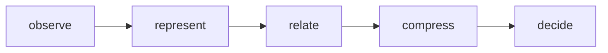

# Minimum Cognitive Core

## Purpose

The Minimum Cognitive Core is Playbook's frozen reasoning kernel.
It is intentionally tiny, deterministic, and domain-agnostic.

## Core API

The kernel API is fixed to five primitives:

- `observe`
- `represent`
- `relate`
- `compress`
- `decide`

## Core objects

The kernel object model is also domain-agnostic:

- `Evidence`: an immutable observation with provenance.
- `Zettel`: a portable representation atom formed from evidence.
- `Edge`: a typed relation between represented atoms.
- `Pattern`: a compressed reusable structure derived from relations.
- `Decision`: an explicit deterministic output with lineage.

## What stays out of the core

The following are explicitly out-of-kernel concerns:

- repo adapters
- CI integrations
- contract mutation logic
- topology compression
- functor transforms
- UI/dashboards

These belong in adapters or extensions around the kernel.

## Kernel boundary statement

The core is the reasoning kernel.
Everything else is adapter or extension behavior layered around it.

## Rule / Pattern / Failure Mode

Rule:
The Playbook core must remain domain-agnostic; domain-specific behavior belongs in adapters.

Pattern:
A stable reasoning engine keeps a tiny cognitive kernel and surrounds it with proposal-driven self-observation.

Failure Mode:
If repo-specific logic leaks into the kernel, or if meta-analysis mutates doctrine directly, the system becomes brittle and loses replayable governance.

## Schema usage (Wave 1A linkage)

For machine-readable Compute/Simulate/Interpret/Adapt (CSIA) mappings used by Wave 1A framework work, use:

- schema: `packages/contracts/src/csia-framework.schema.json`
- examples: `docs/examples/csia-framework.mappings.json`

This document remains conceptual; the schema and examples carry the structured contract and concrete mappings.
